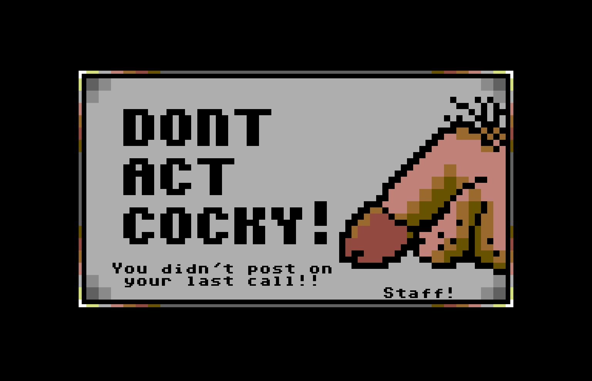

# PETSCII

## Breaking the rules since 1977
When it comes to the vast world of PETSCII, few images capture it's essence better than this one. It perfectly embodies the C\*Base PETSCII experience — unfiltered, and unapologetic. This is C\*Base in it's raw rebellious adolescence. No excuses, no punches pulled — just the real deal. Data! [^1]

{ loading=lazy }

Drawn by [Jucke/Judas](https://csdb.dk/scener/?id=647) in the summer of 1992 for [Paradize](https://csdb.dk/bbs/?id=218) in Gothenburg, a BBS where both Jucke and [Newscopy/G*P](https://csdb.dk/scener/?id=8094) were co-sysops. The infamous line "Don't act cocky!" comes straight from Newscopy himself — a phrase he was known to throw around often.

[^1]: The magical word "data", can be used as a noun, a verb and a even behave as an adjective in for example "data processing". Now THAT is something to think about.