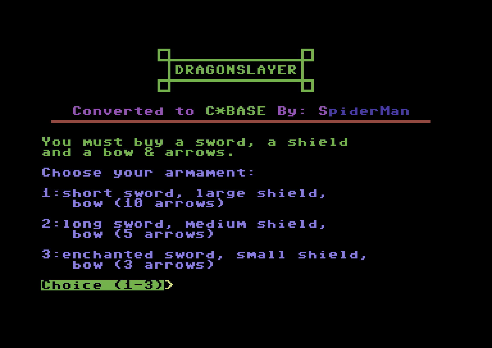

# Dragonslayer

## Introduction
Dragonslayer is a single-player game where you take on the role of a knight sworn to King George. Your mission is clear: find the dragon and end its reign of terror.

{ loading=lazy }

## Gameplay
You are the dragonslayer. To strike with your sword, you must be exactly one pace away from the beast. You also carry a bow with ten arrows — use them wisely. Your shield can block dragon fire, but only three times before it shatters.

A single blow from your sword or a well-placed arrow is enough to bring down the dragon — if your aim is true. But the dragon won’t wait quietly. It will attack with fire, and it won’t miss often. Choose your distance, time your attacks, and survive long enough to make the kill.

## Sources
This package includes the fully compiled module, the original and fixed BASIC source code, and all available game resources.

| Module            | C\*Base version        | Tested           | File                            |
| :---------------- | :--------------------- | :--------------- | ------------------------------- |
| Dragonslayer [^1] | C\*Base v3.1 Larry Mod | :material-check: | [ZIP](sources/dragonslayer.zip) |

[^1]: Decompiled, fixed and put together by [Larry/ROLE](https://csdb.dk/scener/?id=7207)