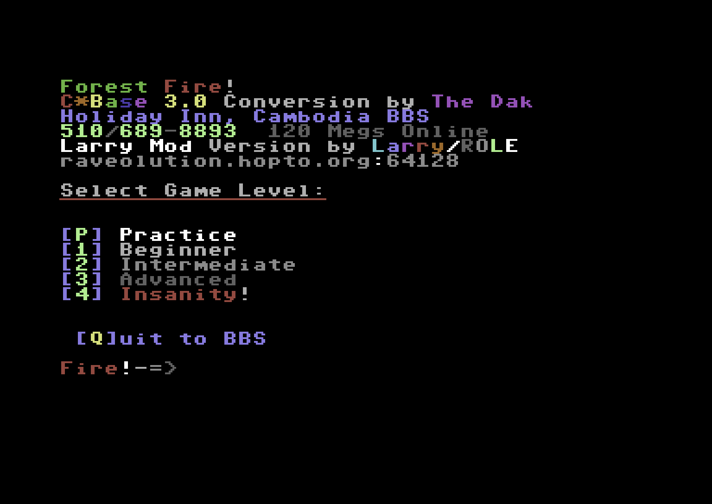

# Forest Fire

## Introduction
In Forest Fire, a wildfire is sweeping through the forest. Some sectors are already burning. Others are untouched — for now. Your job is to stop the spread, protect what you can, and contain the damage before the fire takes everything.

The fire moves fast. Every decision counts.

{ loading=lazy }

## Gameplay
You play on a forest grid. The fire is already active in several sectors when the game begins. Your task is to stop it before it gets out of hand.

You have two tools at your disposal:
- Chemicals – Use these on a burning sector. If they work, they weaken the fire there and reduce its chance of spreading nearby.
- Backfire – Set a controlled fire in a safe sector. It burns for one turn and doesn’t spread, allowing you to create a barrier.

To succeed, you need to act quickly and think ahead. Focus on protecting untouched sectors, slowing the blaze, and holding your ground as the fire pushes forward.

## Sources
This package includes the fully compiled module, the original and fixed BASIC source code, and all available game resources.

| Module           | C\*Base version        | Tested           | File                           |
| :--------------- | :--------------------- | :--------------- | ------------------------------ |
| Forest fire [^1] | C\*Base v3.1 Larry Mod | :material-check: | [ZIP](sources/forest-fire.zip) |

[^1]: Decompiled, fixed and put together by [Larry/ROLE](https://csdb.dk/scener/?id=7207)